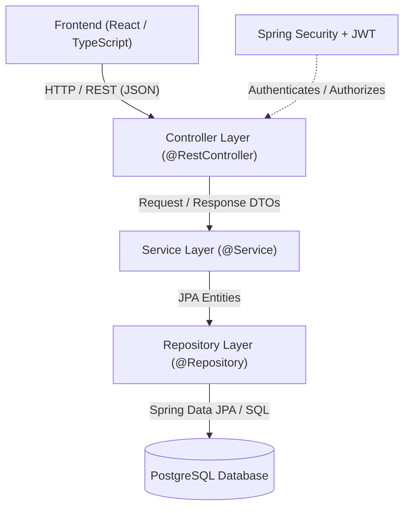

# HIRECONNECT — Backend Design Document

Version: 1.1  
Date: 2026-08-30  
Project: HireConnect Job Recruitment Platform

A comprehensive technical blueprint for the HireConnect backend: entities, DTOs, services, repositories, APIs, security, validation rules, and testing guidance.

---

## Table of Contents

- [1. Project Overview](#1-project-overview)
- [2. Technology Stack](#2-technology-stack)
- [3. Backend Architecture](#3-backend-architecture)
- [4. Package Structure](#4-package-structure)
- [5. Entity Design](#5-entity-design)
  - [5.1 User](#51-user)
  - [5.2 Company](#52-company)
  - [5.3 Job](#53-job)
  - [5.4 JobApplication](#54-jobapplication)
- [6. Enum Design](#6-enum-design)
- [7. Entity Relationships](#7-entity-relationships)
- [8. Repository Design](#8-repository-design)
  - [8.1 UserRepository](#81-userrepository)
  - [8.2 CompanyRepository](#82-companyrepository)
  - [8.3 JobRepository](#83-jobrepository)
  - [8.4 JobApplicationRepository](#84-jobapplicationrepository)
- [9. DTO (Data Transfer Object) Design](#9-dto-data-transfer-object-design)
  - [9.1 Authentication & Authorization DTOs](#91-authentication--authorization-dtos)
  - [9.2 User DTOs](#92-user-dtos)
  - [9.3 Company DTOs](#93-company-dtos)
  - [9.4 Job DTOs](#94-job-dtos)
  - [9.5 Job Application DTOs](#95-job-application-dtos)
  - [9.6 Common & Response Envelope DTOs](#96-common--response-envelope-dtos)
- [10. Service Layer Design](#10-service-layer-design)
- [11. Controller / REST API Specification](#11-controller--rest-api-specification)
- [12. REST API Summary Table](#12-rest-api-summary-table)
- [13. Security Design](#13-security-design)
  - [13.1 JWT Design](#131-jwt-design)
  - [13.2 Role-Based Access Control (RBAC)](#132-role-based-access-control-rbac)
- [14. Ownership & Authorization Rules](#14-ownership--authorization-rules)
- [15. Validation Rules](#15-validation-rules)
- [16. Business Rules](#16-business-rules)
- [17. Exception Handling & Error Responses](#17-exception-handling--error-responses)
- [18. HTTP Status Codes](#18-http-status-codes)
- [19. Pagination & Filtering](#19-pagination--filtering)
- [20. Database Constraints](#20-database-constraints)
- [21. Data Flow (Common Flows)](#21-data-flow-common-flows)
- [22. Frontend Integration Plan](#22-frontend-integration-plan)
- [23. Postman Testing Plan](#23-postman-testing-plan)
- [24. Development Phases](#24-development-phases)
- [25. Architecture Diagram](#25-architecture-diagram)
- [26. Backend Implementation Checklist](#26-backend-implementation-checklist)

---

## 1. Project Overview

**HireConnect** is a modern job recruitment and applicant tracking platform connecting job seekers, employers, and platform administrators.

### Core User Roles
- **JOB_SEEKER**: Search jobs, manage profiles/resumes, apply for open positions, and track application statuses.
- **EMPLOYER**: Create and manage company profile, post and manage job listings, review applicant submissions, and manage hiring pipeline statuses.
- **ADMIN**: Platform governance, monitor users/companies/jobs, and activate/deactivate accounts.

---

## 2. Technology Stack

- **Language**: Java 21 (LTS)
- **Framework**: Spring Boot 3.x / 4.x
- **Web Layer**: Spring MVC / Spring REST
- **Data Access**: Spring Data JPA, Hibernate ORM
- **Database**: PostgreSQL (Production), H2 (In-Memory for unit/integration tests)
- **Security**: Spring Security 6.x, JJWT (io.jsonwebtoken 0.12.6), BCrypt password hashing
- **Validation**: Jakarta Bean Validation (`spring-boot-starter-validation` / Hibernate Validator)
- **Utilities**: Lombok, Jackson (JSON serialization/deserialization)

---

## 3. Backend Architecture

HireConnect follows a multi-tier layered architecture:

```
[ Client / Frontend (React + TypeScript) ]
                   │
                   ▼ (HTTP JSON REST APIs)
[ Controller Layer ]  ── Handles HTTP requests, input validation, maps DTOs
                   │
                   ▼ (DTOs & Domain Objects)
[ Service Layer ]     ── Business logic, transactions (@Transactional), authorization
                   │
                   ▼ (Entities)
[ Repository Layer ]  ── Spring Data JPA interfaces, custom JPQL / Native queries
                   │
                   ▼ (SQL)
[ Database Layer ]    ── PostgreSQL Relational Database
```

> [!IMPORTANT]
> **Architectural Boundary Rule**: Controllers must only accept Request DTOs and return Response DTOs. JPA Entity objects must remain internal to the Service and Repository layers to prevent data leakage (such as hashed passwords) and prevent unintended lazy loading or circular serialization issues.

---

## 4. Package Structure

```
com.mohiuddin.HireConnect
├── Config/                  # SecurityConfig, CorsConfig, AppConfig, Swagger/OpenAPI
├── Controller/              # REST Controllers (@RestController)
├── Model/
│   ├── Dto/                 # Request & Response Data Transfer Objects
│   ├── Entities/            # JPA Entity models (@Entity)
│   └── Enums/               # Domain Enums (Role, JobStatus, etc.)
├── Repository/              # Spring Data JPA Repositories
├── Security/                # JwtTokenProvider, JwtAuthFilter, UserDetailsServiceImpl
├── Service/                 # Business service interfaces
├── ServiceImpl/             # Service implementations (@Service)
└── Exception/               # Custom exceptions & GlobalExceptionHandler (@RestControllerAdvice)
```

---

## 5. Entity Design

All timestamps use `java.time.LocalDateTime` (persisted as `TIMESTAMP` in PostgreSQL). Primary keys are `Long` (`BIGINT` auto-increment).

### 5.1 User
- **Table Name**: `users` *(Avoids collision with the PostgreSQL reserved keyword `user`)*

| Field | Java Type | DB Type | Nullable | Unique | Notes & Annotations |
| :--- | :--- | :--- | :---: | :---: | :--- |
| `id` | `Long` | `BIGINT` | No | Yes | Primary Key, `@GeneratedValue(strategy = IDENTITY)` |
| `name` | `String` | `VARCHAR(100)` | No | No | Full display name |
| `email` | `String` | `VARCHAR(255)` | No | Yes | Unique login email identifier |
| `password` | `String` | `VARCHAR(255)` | No | No | BCrypt hashed password (Never returned in DTOs) |
| `role` | `Role` | `VARCHAR(20)` | No | No | `@Enumerated(EnumType.STRING)`, Role enum |
| `phone` | `String` | `VARCHAR(20)` | Yes | No | Contact phone number |
| `location` | `String` | `VARCHAR(100)` | Yes | No | City, State, Country |
| `profileImage` | `String` | `VARCHAR(255)` | Yes | No | `@Column(name = "profile_image")`, Avatar URL |
| `headline` | `String` | `VARCHAR(150)` | Yes | No | Professional title / headline |
| `about` | `String` | `TEXT` | Yes | No | Bio summary / description |
| `resumeUrl` | `String` | `VARCHAR(255)` | Yes | No | `@Column(name = "resume_url")`, Default resume URL |
| `enabled` | `boolean` | `BOOLEAN` | No | No | `@Builder.Default = true`, Account status |
| `createdAt` | `LocalDateTime` | `TIMESTAMP` | No | No | `@CreationTimestamp`, `@Column(name = "created_at", updatable = false)` |
| `updatedAt` | `LocalDateTime` | `TIMESTAMP` | No | No | `@UpdateTimestamp`, `@Column(name = "updated_at")` |

---

### 5.2 Company
- **Table Name**: `companies`

| Field | Java Type | DB Type | Nullable | Unique | Notes & Annotations |
| :--- | :--- | :--- | :---: | :---: | :--- |
| `id` | `Long` | `BIGINT` | No | Yes | Primary Key, `@GeneratedValue(strategy = IDENTITY)` |
| `name` | `String` | `VARCHAR(150)` | No | Yes | Company business name |
| `description` | `String` | `TEXT` | No | No | Overview of company operations |
| `website` | `String` | `VARCHAR(255)` | Yes | No | Official website URL |
| `logoUrl` | `String` | `VARCHAR(255)` | Yes | No | `@Column(name = "logo_url")`, Logo image URL |
| `industry` | `String` | `VARCHAR(100)` | No | No | Industry domain (e.g., Software, Fintech) |
| `companySize` | `String` | `VARCHAR(50)` | Yes | No | `@Column(name = "company_size")`, e.g., "11-50 employees" |
| `location` | `String` | `VARCHAR(150)` | No | No | Company headquarters location |
| `foundedYear` | `Integer` | `INTEGER` | Yes | No | `@Column(name = "founded_year")`, Founding year |
| `employer` | `User` | `BIGINT` | No | Yes | `@OneToOne`, `@JoinColumn(name = "employer_id", unique = true)` |
| `createdAt` | `LocalDateTime` | `TIMESTAMP` | No | No | `@CreationTimestamp`, `@Column(name = "created_at", updatable = false)` |
| `updatedAt` | `LocalDateTime` | `TIMESTAMP` | No | No | `@UpdateTimestamp`, `@Column(name = "updated_at")` |

---

### 5.3 Job
- **Table Name**: `jobs`

| Field | Java Type | DB Type | Nullable | Unique | Notes & Annotations |
| :--- | :--- | :--- | :---: | :---: | :--- |
| `id` | `Long` | `BIGINT` | No | Yes | Primary Key, `@GeneratedValue(strategy = IDENTITY)` |
| `title` | `String` | `VARCHAR(150)` | No | No | Job opening title |
| `description` | `String` | `TEXT` | No | No | Full role overview |
| `responsibilities` | `String` | `TEXT` | No | No | Detailed list of duties |
| `requirements` | `String` | `TEXT` | No | No | Required skills & experience |
| `salaryMin` | `BigDecimal` | `DECIMAL(10,2)` | Yes | No | `@Column(name = "salary_min")`, Minimum salary |
| `salaryMax` | `BigDecimal` | `DECIMAL(10,2)` | Yes | No | `@Column(name = "salary_max")`, Maximum salary |
| `currency` | `String` | `VARCHAR(3)` | Yes | No | ISO 4217 currency code (e.g., "USD", "EUR") |
| `location` | `String` | `VARCHAR(150)` | No | No | Job work location / city |
| `category` | `String` | `VARCHAR(100)` | No | No | Functional category (e.g., Engineering, Marketing) |
| `employmentType` | `EmploymentType` | `VARCHAR(30)` | No | No | `@Enumerated(EnumType.STRING)`, `@Column(name = "employment_type")` |
| `experienceLevel` | `ExperienceLevel` | `VARCHAR(30)` | No | No | `@Enumerated(EnumType.STRING)`, `@Column(name = "experience_level")` |
| `workArrangement` | `WorkArrangement` | `VARCHAR(30)` | No | No | `@Enumerated(EnumType.STRING)`, `@Column(name = "work_arrangement")` |
| `status` | `JobStatus` | `VARCHAR(20)` | No | No | `@Enumerated(EnumType.STRING)`, Default `ACTIVE` |
| `applicationDeadline` | `LocalDate` | `DATE` | Yes | No | `@Column(name = "application_deadline")`, Expiry date |
| `company` | `Company` | `BIGINT` | No | No | `@ManyToOne(fetch = LAZY)`, `@JoinColumn(name = "company_id")` |
| `createdBy` | `User` | `BIGINT` | No | No | `@ManyToOne(fetch = LAZY)`, `@JoinColumn(name = "created_by")` |
| `createdAt` | `LocalDateTime` | `TIMESTAMP` | No | No | `@CreationTimestamp`, `@Column(name = "created_at", updatable = false)` |
| `updatedAt` | `LocalDateTime` | `TIMESTAMP` | No | No | `@UpdateTimestamp`, `@Column(name = "updated_at")` |

---

### 5.4 JobApplication
- **Table Name**: `job_applications`

| Field | Java Type | DB Type | Nullable | Unique | Notes & Annotations |
| :--- | :--- | :--- | :---: | :---: | :--- |
| `id` | `Long` | `BIGINT` | No | Yes | Primary Key, `@GeneratedValue(strategy = IDENTITY)` |
| `job` | `Job` | `BIGINT` | No | No | `@ManyToOne(fetch = LAZY)`, `@JoinColumn(name = "job_id")` |
| `applicant` | `User` | `BIGINT` | No | No | `@ManyToOne(fetch = LAZY)`, `@JoinColumn(name = "applicant_id")` |
| `resumeUrl` | `String` | `VARCHAR(255)` | No | No | `@Column(name = "resume_url")`, Document URL |
| `coverLetter` | `String` | `TEXT` | Yes | No | `@Column(name = "cover_letter")`, Cover letter text |
| `portfolioUrl` | `String` | `VARCHAR(255)` | Yes | No | `@Column(name = "portfolio_url")`, Portfolio website |
| `linkedInUrl` | `String` | `VARCHAR(255)` | Yes | No | `@Column(name = "linkedin_url")`, LinkedIn profile URL |
| `status` | `ApplicationStatus`| `VARCHAR(30)` | No | No | `@Enumerated(EnumType.STRING)`, Default `APPLIED` |
| `appliedAt` | `LocalDateTime` | `TIMESTAMP` | No | No | `@CreationTimestamp`, `@Column(name = "applied_at", updatable = false)` |
| `updatedAt` | `LocalDateTime` | `TIMESTAMP` | No | No | `@UpdateTimestamp`, `@Column(name = "updated_at")` |

> [!NOTE]
> **Unique Constraint**: A unique composite constraint `@Table(uniqueConstraints = @UniqueConstraint(name = "uk_job_applicant", columnNames = {"job_id", "applicant_id"}))` prevents applicants from submitting duplicate applications to the same job.

---

## 6. Enum Design

All enums are placed in package `com.mohiuddin.HireConnect.Model.Enums`:

- **Role**: `JOB_SEEKER`, `EMPLOYER`, `ADMIN`
- **JobStatus**: `DRAFT`, `ACTIVE`, `CLOSED`
- **EmploymentType**: `FULL_TIME`, `PART_TIME`, `CONTRACT`, `INTERNSHIP`, `FREELANCE`
- **ExperienceLevel**: `ENTRY_LEVEL`, `MID_LEVEL`, `SENIOR_LEVEL`, `LEAD`
- **WorkArrangement**: `REMOTE`, `HYBRID`, `ON_SITE`
- **ApplicationStatus**: `APPLIED`, `SHORTLISTED`, `INTERVIEW`, `ACCEPTED`, `REJECTED`

---

## 7. Entity Relationships

```
┌──────────────────┐               ┌──────────────────┐
│  User (EMPLOYER) │ 1 ───────── 1 │     Company      │
└────────┬─────────┘               └────────┬─────────┘
         │ 1                                │ 1
         │                                  │
         │ *                                │ *
┌────────┴─────────┐               ┌────────┴─────────┐
│       Job        ├───────────────┤       Job        │
└────────┬─────────┘               └──────────────────┘
         │ 1
         │
         │ *
┌────────┴─────────┐
│  JobApplication  │
└────────┬─────────┘
         │ *
         │
         │ 1
┌────────┴─────────┐
│ User(JOB_SEEKER) │
└──────────────────┘
```

---

## 8. Repository Design

All repositories extend `JpaRepository<Entity, Long>` and `JpaSpecificationExecutor<Entity>` where dynamic filtering is required.

### 8.1 UserRepository
- `Optional<User> findByEmail(String email)`
- `boolean existsByEmail(String email)`
- `Page<User> findByRole(Role role, Pageable pageable)`

### 8.2 CompanyRepository
- `Optional<Company> findByEmployerId(Long employerId)`
- `boolean existsByName(String name)`
- `boolean existsByEmployerId(Long employerId)`

### 8.3 JobRepository
- `Page<Job> findByStatus(JobStatus status, Pageable pageable)`
- `Page<Job> findByCompanyId(Long companyId, Pageable pageable)`
- `Page<Job> findByCreatedById(Long employerId, Pageable pageable)`
- `long countByCompanyId(Long companyId)`

### 8.4 JobApplicationRepository
- `Page<JobApplication> findByApplicantId(Long applicantId, Pageable pageable)`
- `Page<JobApplication> findByJobId(Long jobId, Pageable pageable)`
- `boolean existsByJobIdAndApplicantId(Long jobId, Long applicantId)`
- `long countByJobId(Long jobId)`

---

## 9. DTO (Data Transfer Object) Design

The DTO layer isolates the internal database schema from client API contracts. Validation annotations (`@NotBlank`, `@Size`, etc.) are placed exclusively on **Request DTOs**.

```
com.mohiuddin.HireConnect.Model.Dto
├── RegisterRequestDto
├── LoginRequestDto
├── AuthResponseDto
├── ChangePasswordRequestDto
├── UserResponseDto
├── UserUpdateRequestDto
├── UserStatusUpdateDto
├── CompanyRequestDto
├── CompanyResponseDto
├── JobCreateRequestDto
├── JobUpdateRequestDto
├── JobStatusUpdateDto
├── JobResponseDto
├── JobApplicationRequestDto
├── ApplicationStatusUpdateDto
├── JobApplicationResponseDto
├── ApiResponse<T>
└── PageResponseDto<T>
```

---

### 9.1 Authentication & Authorization DTOs

#### `RegisterRequestDto` (User Registration Request)
- **Used In**: `POST /api/auth/register`
- **Purpose**: Carries user payload for creating a new user account.

| Field Name | Java Type | Required | Validation Rules | Description & Usage |
| :--- | :--- | :---: | :--- | :--- |
| `name` | `String` | Yes | `@NotBlank`, `@Size(min = 2, max = 100)` | Full name of the user |
| `email` | `String` | Yes | `@NotBlank`, `@Email`, `@Size(max = 255)` | Unique account login email |
| `password` | `String` | Yes | `@NotBlank`, `@Size(min = 6, max = 100)` | Plain-text password (hashed with BCrypt in Service) |
| `role` | `Role` | Yes | `@NotNull` | Target role (`JOB_SEEKER` or `EMPLOYER`) |
| `phone` | `String` | No | `@Size(max = 20)` | Optional contact number |
| `location` | `String` | No | `@Size(max = 100)` | City/Country location |

#### `LoginRequestDto` (User Login Request)
- **Used In**: `POST /api/auth/login`
- **Purpose**: Carries credentials to authenticate a user.

| Field Name | Java Type | Required | Validation Rules | Description & Usage |
| :--- | :--- | :---: | :--- | :--- |
| `email` | `String` | Yes | `@NotBlank`, `@Email` | User's registered email |
| `password` | `String` | Yes | `@NotBlank` | User's password |

#### `AuthResponseDto` (Authentication Token Response)
- **Used In**: Response for `POST /api/auth/login` & `POST /api/auth/register`
- **Purpose**: Returns JWT access token and logged-in user profile to the client.

| Field Name | Java Type | Required | Description & Usage |
| :--- | :--- | :---: | :--- |
| `accessToken` | `String` | Yes | JWT Bearer access token used for Authorization header |
| `tokenType` | `String` | Yes | Token type prefix (Default: `"Bearer"`) |
| `user` | `UserResponseDto` | Yes | Authenticated user profile details |

#### `ChangePasswordRequestDto` (Password Update Request)
- **Used In**: `PUT /api/auth/change-password`
- **Purpose**: Allows authenticated users to change their password securely.

| Field Name | Java Type | Required | Validation Rules | Description & Usage |
| :--- | :--- | :---: | :--- | :--- |
| `currentPassword` | `String` | Yes | `@NotBlank` | Existing password to verify identity |
| `newPassword` | `String` | Yes | `@NotBlank`, `@Size(min = 6, max = 100)` | New password to hash and store |

---

### 9.2 User DTOs

#### `UserResponseDto` (User Profile Response)
- **Used In**: `GET /api/users/me`, `GET /api/users/{id}`, `GET /api/admin/users`, `AuthResponseDto`
- **Purpose**: Returns user profile details safely without exposing sensitive data (password excluded).

| Field Name | Java Type | Required | Description & Usage |
| :--- | :--- | :---: | :--- |
| `id` | `Long` | Yes | User's unique database identifier |
| `name` | `String` | Yes | Full name of the user |
| `email` | `String` | Yes | User email address |
| `role` | `Role` | Yes | User role (`JOB_SEEKER`, `EMPLOYER`, `ADMIN`) |
| `phone` | `String` | No | Phone number |
| `location` | `String` | No | Location / city / country |
| `profileImage` | `String` | No | Avatar image URL |
| `headline` | `String` | No | Professional title / headline |
| `about` | `String` | No | Biography / summary |
| `resumeUrl` | `String` | No | Default uploaded resume link |
| `enabled` | `boolean` | Yes | Account active status (`true`/`false`) |
| `createdAt` | `LocalDateTime` | Yes | Account creation timestamp |
| `updatedAt` | `LocalDateTime` | Yes | Last account modification timestamp |

#### `UserUpdateRequestDto` (User Profile Update Request)
- **Used In**: `PUT /api/users/me`
- **Purpose**: Allows users to update their personal and professional profile information.

| Field Name | Java Type | Required | Validation Rules | Description & Usage |
| :--- | :--- | :---: | :--- | :--- |
| `name` | `String` | Yes | `@NotBlank`, `@Size(max = 100)` | Updated full name |
| `phone` | `String` | No | `@Size(max = 20)` | Updated phone number |
| `location` | `String` | No | `@Size(max = 100)` | Updated location |
| `profileImage` | `String` | No | `@Size(max = 255)` | Updated avatar image URL |
| `headline` | `String` | No | `@Size(max = 150)` | Updated professional headline |
| `about` | `String` | No | — | Updated bio / summary text |
| `resumeUrl` | `String` | No | `@Size(max = 255)` | Updated default resume URL |

#### `UserStatusUpdateDto` (Admin Account Status Update)
- **Used In**: `PATCH /api/admin/users/{id}/status`
- **Purpose**: Admin activates or deactivates a user account.

| Field Name | Java Type | Required | Validation Rules | Description & Usage |
| :--- | :--- | :---: | :--- | :--- |
| `enabled` | `Boolean` | Yes | `@NotNull` | New active status (`true` = active, `false` = disabled) |

---

### 9.3 Company DTOs

#### `CompanyRequestDto` (Company Create / Update Request)
- **Used In**: `POST /api/companies`, `PUT /api/companies/{id}`
- **Purpose**: Employer creates or modifies their company profile.

| Field Name | Java Type | Required | Validation Rules | Description & Usage |
| :--- | :--- | :---: | :--- | :--- |
| `name` | `String` | Yes | `@NotBlank`, `@Size(max = 150)` | Registered company name |
| `description` | `String` | Yes | `@NotBlank` | Detailed company overview |
| `website` | `String` | No | `@Size(max = 255)` | Company website URL |
| `logoUrl` | `String` | No | `@Size(max = 255)` | Company logo image URL |
| `industry` | `String` | Yes | `@NotBlank`, `@Size(max = 100)` | Industry category (e.g. Technology) |
| `companySize` | `String` | No | `@Size(max = 50)` | Size bracket (e.g., "50-200 employees") |
| `location` | `String` | Yes | `@NotBlank`, `@Size(max = 150)` | Company HQ location |
| `foundedYear` | `Integer` | No | `@Min(1800)` | Year company was established |

#### `CompanyResponseDto` (Company Profile Response)
- **Used In**: `GET /api/companies/{id}`, `GET /api/companies`, `GET /api/companies/my`
- **Purpose**: Public and employer-facing company profile response.

| Field Name | Java Type | Required | Description & Usage |
| :--- | :--- | :---: | :--- |
| `id` | `Long` | Yes | Unique company database identifier |
| `name` | `String` | Yes | Company name |
| `description` | `String` | Yes | Company description |
| `website` | `String` | No | Website URL |
| `logoUrl` | `String` | No | Company logo URL |
| `industry` | `String` | Yes | Industry classification |
| `companySize` | `String` | No | Company size range |
| `location` | `String` | Yes | Headquarters location |
| `foundedYear` | `Integer` | No | Founding year |
| `employerId` | `Long` | Yes | ID of the employer user who owns this company |
| `employerName` | `String` | Yes | Full name of the employer owner |
| `jobsCount` | `long` | Yes | Total active jobs posted by this company |
| `createdAt` | `LocalDateTime` | Yes | Creation timestamp |
| `updatedAt` | `LocalDateTime` | Yes | Last update timestamp |

---

### 9.4 Job DTOs

#### `JobCreateRequestDto` (Create Job Request)
- **Used In**: `POST /api/jobs`
- **Purpose**: Employer creates a new job listing.

| Field Name | Java Type | Required | Validation Rules | Description & Usage |
| :--- | :--- | :---: | :--- | :--- |
| `title` | `String` | Yes | `@NotBlank`, `@Size(max = 150)` | Job opening title |
| `description` | `String` | Yes | `@NotBlank` | Comprehensive job description |
| `responsibilities`| `String`| Yes | `@NotBlank` | Bulleted/formatted list of responsibilities |
| `requirements` | `String` | Yes | `@NotBlank` | Bulleted/formatted list of qualifications |
| `salaryMin` | `BigDecimal`| No | `@DecimalMin("0.0")` | Minimum salary range |
| `salaryMax` | `BigDecimal`| No | `@DecimalMin("0.0")` | Maximum salary range |
| `currency` | `String` | No | `@Size(min = 3, max = 3)` | 3-letter currency code (e.g., "USD") |
| `location` | `String` | Yes | `@NotBlank`, `@Size(max = 150)` | Physical location or "Remote" |
| `category` | `String` | Yes | `@NotBlank`, `@Size(max = 100)` | Category (e.g. Software, Design) |
| `employmentType` | `EmploymentType` | Yes | `@NotNull` | `FULL_TIME`, `PART_TIME`, `CONTRACT`, etc. |
| `experienceLevel`| `ExperienceLevel`| Yes | `@NotNull` | `ENTRY_LEVEL`, `MID_LEVEL`, `SENIOR_LEVEL`, etc.|
| `workArrangement`| `WorkArrangement`| Yes | `@NotNull` | `REMOTE`, `HYBRID`, `ON_SITE` |
| `applicationDeadline`| `LocalDate` | No | `@Future` | Last date to accept applications |

#### `JobUpdateRequestDto` (Update Job Request)
- **Used In**: `PUT /api/jobs/{id}`
- **Purpose**: Employer updates an existing job listing.

| Field Name | Java Type | Required | Validation Rules | Description & Usage |
| :--- | :--- | :---: | :--- | :--- |
| *(All fields from `JobCreateRequestDto`)* | *(Same)* | *(Same)* | *(Same)* | Updated details of the job listing |
| `status` | `JobStatus` | No | — | Optional update to job status (`DRAFT`, `ACTIVE`, `CLOSED`) |

#### `JobStatusUpdateDto` (Quick Job Status Update)
- **Used In**: `PATCH /api/jobs/{id}/status`
- **Purpose**: Employer opens, pauses, or closes a job posting.

| Field Name | Java Type | Required | Validation Rules | Description & Usage |
| :--- | :--- | :---: | :--- | :--- |
| `status` | `JobStatus` | Yes | `@NotNull` | Target status (`DRAFT`, `ACTIVE`, `CLOSED`) |

#### `JobResponseDto` (Job Details Response)
- **Used In**: `GET /api/jobs`, `GET /api/jobs/{id}`, `GET /api/employer/jobs`
- **Purpose**: Public and employer job view with associated company details.

| Field Name | Java Type | Required | Description & Usage |
| :--- | :--- | :---: | :--- |
| `id` | `Long` | Yes | Unique job ID |
| `title` | `String` | Yes | Job title |
| `description` | `String` | Yes | Job description |
| `responsibilities` | `String` | Yes | Job responsibilities |
| `requirements` | `String` | Yes | Job requirements |
| `salaryMin` | `BigDecimal` | No | Minimum salary |
| `salaryMax` | `BigDecimal` | No | Maximum salary |
| `currency` | `String` | No | Currency code |
| `location` | `String` | Yes | Job location |
| `category` | `String` | Yes | Function category |
| `employmentType` | `EmploymentType` | Yes | Employment type enum |
| `experienceLevel` | `ExperienceLevel` | Yes | Experience level enum |
| `workArrangement` | `WorkArrangement` | Yes | Work arrangement enum |
| `status` | `JobStatus` | Yes | Current status (`ACTIVE`, `DRAFT`, `CLOSED`) |
| `applicationDeadline` | `LocalDate` | No | Application deadline |
| `companyId` | `Long` | Yes | Associated company ID |
| `companyName` | `String` | Yes | Company display name |
| `companyLogoUrl` | `String` | No | Company logo image URL |
| `employerId` | `Long` | Yes | Employer who posted the job |
| `applicationsCount` | `long` | Yes | Number of candidates who applied |
| `createdAt` | `LocalDateTime` | Yes | Job post timestamp |
| `updatedAt` | `LocalDateTime` | Yes | Last update timestamp |

---

### 9.5 Job Application DTOs

#### `JobApplicationRequestDto` (Submit Application Request)
- **Used In**: `POST /api/applications`
- **Purpose**: Job seeker submits an application for a specific job.

| Field Name | Java Type | Required | Validation Rules | Description & Usage |
| :--- | :--- | :---: | :--- | :--- |
| `jobId` | `Long` | Yes | `@NotNull` | Target job ID |
| `resumeUrl` | `String` | Yes | `@NotBlank`, `@Size(max = 255)` | URL of resume used for this application |
| `coverLetter` | `String` | No | — | Optional cover letter text |
| `portfolioUrl` | `String` | No | `@Size(max = 255)` | Optional link to candidate portfolio/GitHub |
| `linkedInUrl` | `String` | No | `@Size(max = 255)` | Optional link to candidate LinkedIn profile |

#### `ApplicationStatusUpdateDto` (Candidate Pipeline Status Update)
- **Used In**: `PATCH /api/applications/{id}/status`
- **Purpose**: Employer updates candidate status in the hiring pipeline.

| Field Name | Java Type | Required | Validation Rules | Description & Usage |
| :--- | :--- | :---: | :--- | :--- |
| `status` | `ApplicationStatus` | Yes | `@NotNull` | `APPLIED`, `SHORTLISTED`, `INTERVIEW`, `ACCEPTED`, `REJECTED` |

#### `JobApplicationResponseDto` (Application Details Response)
- **Used In**: `GET /api/applications/my`, `GET /api/jobs/{jobId}/applications`, `GET /api/applications/{id}`
- **Purpose**: Displays full application status, job summary, and applicant profile.

| Field Name | Java Type | Required | Description & Usage |
| :--- | :--- | :---: | :--- |
| `id` | `Long` | Yes | Unique application ID |
| `jobId` | `Long` | Yes | Associated job ID |
| `jobTitle` | `String` | Yes | Title of applied job |
| `companyId` | `Long` | Yes | Company ID of job |
| `companyName` | `String` | Yes | Company name |
| `companyLogoUrl` | `String` | No | Company logo URL |
| `applicantId` | `Long` | Yes | Candidate user ID |
| `applicantName` | `String` | Yes | Candidate full name |
| `applicantEmail` | `String` | Yes | Candidate email |
| `applicantPhone` | `String` | No | Candidate phone |
| `resumeUrl` | `String` | Yes | Submitted resume URL |
| `coverLetter` | `String` | No | Submitted cover letter |
| `portfolioUrl` | `String` | No | Portfolio URL |
| `linkedInUrl` | `String` | No | LinkedIn URL |
| `status` | `ApplicationStatus`| Yes | Current status in hiring pipeline |
| `appliedAt` | `LocalDateTime` | Yes | Submission timestamp |
| `updatedAt` | `LocalDateTime` | Yes | Timestamp of last status change |

---

### 9.6 Common & Response Envelope DTOs

#### `ApiResponse<T>` (Standard Unified Response Envelope)
- **Used In**: All REST endpoints returning single entities or operational messages.

| Field Name | Java Type | Description & Usage |
| :--- | :--- | :--- |
| `success` | `boolean` | Indicates whether the request succeeded (`true`/`false`) |
| `message` | `String` | Human-readable outcome message (e.g. "Job created successfully") |
| `data` | `T` | Payload object (e.g., `JobResponseDto`, `UserResponseDto`) |
| `timestamp` | `LocalDateTime` | Server response generation timestamp |

#### `PageResponseDto<T>` (Standard Paginated List Envelope)
- **Used In**: All paginated search & list endpoints (`GET /api/jobs`, `GET /api/applications`, etc.).

| Field Name | Java Type | Description & Usage |
| :--- | :--- | :--- |
| `content` | `List<T>` | List of records for current page |
| `pageNumber` | `int` | Current 0-based page index |
| `pageSize` | `int` | Number of items per page |
| `totalElements` | `long` | Total number of matching records in database |
| `totalPages` | `int` | Total available pages |
| `last` | `boolean` | `true` if this is the final page |

---

## 10. Service Layer Design

- **AuthService**: Handles registration, login authentication, JWT token generation, password encryption & changes.
- **UserService**: Fetches/updates user profiles, manages account status.
- **CompanyService**: Handles company registration, updates, ownership validation, and public company directory.
- **JobService**: Handles job lifecycle (create, update, close), search and multi-criteria filtering.
- **JobApplicationService**: Handles application submission, duplicate checks, seeker history, employer applicant review, status progression.

---

## 11. Controller / REST API Specification

### Base URL: `/api`

### 11.1 Auth Controller (`/api/auth`)
- `POST /api/auth/register` — Public. Registers `JOB_SEEKER` or `EMPLOYER`.
- `POST /api/auth/login` — Public. Validates credentials and returns JWT.
- `PUT /api/auth/change-password` — Authenticated. Updates password.

### 11.2 User Controller (`/api/users`)
- `GET /api/users/me` — Authenticated. Gets logged-in user profile.
- `PUT /api/users/me` — Authenticated. Updates logged-in user profile.
- `GET /api/users/{id}` — Authenticated. Gets public user profile.

### 11.3 Company Controller (`/api/companies`)
- `POST /api/companies` — Role: `EMPLOYER`. Creates company profile.
- `GET /api/companies/{id}` — Public. Gets company details by ID.
- `GET /api/companies/my` — Role: `EMPLOYER`. Gets employer's owned company.
- `PUT /api/companies/{id}` — Role: `EMPLOYER` (Owner). Updates company profile.
- `GET /api/companies` — Public. Gets paginated companies.

### 11.4 Job Controller (`/api/jobs`)
- `GET /api/jobs` — Public. Searches active jobs with filters (keyword, location, type, category).
- `GET /api/jobs/{id}` — Public. Gets full job details.
- `POST /api/jobs` — Role: `EMPLOYER`. Posts a new job.
- `PUT /api/jobs/{id}` — Role: `EMPLOYER` (Owner). Updates job posting.
- `PATCH /api/jobs/{id}/status` — Role: `EMPLOYER` (Owner). Updates job status.
- `DELETE /api/jobs/{id}` — Role: `EMPLOYER` (Owner) or `ADMIN`. Deletes/Archives job.
- `GET /api/jobs/my-postings` — Role: `EMPLOYER`. Gets employer's posted jobs.

### 11.5 Job Application Controller (`/api/applications`)
- `POST /api/applications` — Role: `JOB_SEEKER`. Submits job application.
- `GET /api/applications/my` — Role: `JOB_SEEKER`. Gets seeker's applied jobs.
- `GET /api/applications/{id}` — Role: Applicant, Job Owner, or `ADMIN`.
- `GET /api/jobs/{jobId}/applications` — Role: `EMPLOYER` (Job Owner). Gets all candidates for job.
- `PATCH /api/applications/{id}/status` — Role: `EMPLOYER` (Job Owner). Updates candidate status.

### 11.6 Admin Controller (`/api/admin`)
- `GET /api/admin/users` — Role: `ADMIN`. Paginated user directory.
- `PATCH /api/admin/users/{id}/status` — Role: `ADMIN`. Enables/disables user account.
- `GET /api/admin/stats` — Role: `ADMIN`. Platform aggregate statistics.

---

## 12. REST API Summary Table

| Endpoint | Method | Role | Request Body | Response Body |
| :--- | :---: | :--- | :--- | :--- |
| `/api/auth/register` | `POST` | Public | `RegisterRequestDto` | `ApiResponse<AuthResponseDto>` |
| `/api/auth/login` | `POST` | Public | `LoginRequestDto` | `ApiResponse<AuthResponseDto>` |
| `/api/auth/change-password` | `PUT` | Authenticated | `ChangePasswordRequestDto` | `ApiResponse<Void>` |
| `/api/users/me` | `GET` | Authenticated | — | `ApiResponse<UserResponseDto>` |
| `/api/users/me` | `PUT` | Authenticated | `UserUpdateRequestDto` | `ApiResponse<UserResponseDto>` |
| `/api/companies` | `POST` | `EMPLOYER` | `CompanyRequestDto` | `ApiResponse<CompanyResponseDto>` |
| `/api/companies/{id}` | `GET` | Public | — | `ApiResponse<CompanyResponseDto>` |
| `/api/companies/my` | `GET` | `EMPLOYER` | — | `ApiResponse<CompanyResponseDto>` |
| `/api/companies/{id}` | `PUT` | `EMPLOYER` (Owner)| `CompanyRequestDto` | `ApiResponse<CompanyResponseDto>` |
| `/api/jobs` | `GET` | Public | Params (Query filters) | `ApiResponse<PageResponseDto<JobResponseDto>>` |
| `/api/jobs/{id}` | `GET` | Public | — | `ApiResponse<JobResponseDto>` |
| `/api/jobs` | `POST` | `EMPLOYER` | `JobCreateRequestDto` | `ApiResponse<JobResponseDto>` |
| `/api/jobs/{id}` | `PUT` | `EMPLOYER` (Owner)| `JobUpdateRequestDto` | `ApiResponse<JobResponseDto>` |
| `/api/jobs/{id}/status` | `PATCH` | `EMPLOYER` (Owner)| `JobStatusUpdateDto` | `ApiResponse<JobResponseDto>` |
| `/api/applications` | `POST` | `JOB_SEEKER` | `JobApplicationRequestDto`| `ApiResponse<JobApplicationResponseDto>` |
| `/api/applications/my` | `GET` | `JOB_SEEKER` | Params (Pageable) | `ApiResponse<PageResponseDto<JobApplicationResponseDto>>` |
| `/api/jobs/{jobId}/applications` | `GET` | `EMPLOYER` (Owner)| Params (Pageable) | `ApiResponse<PageResponseDto<JobApplicationResponseDto>>` |
| `/api/applications/{id}/status` | `PATCH` | `EMPLOYER` (Owner)| `ApplicationStatusUpdateDto` | `ApiResponse<JobApplicationResponseDto>` |
| `/api/admin/users/{id}/status` | `PATCH` | `ADMIN` | `UserStatusUpdateDto` | `ApiResponse<UserResponseDto>` |

---

## 13. Security Design

### 13.1 JWT Design
- Algorithm: HMAC-SHA256 (`HS256` or `HS512`)
- Token Expiration: 24 hours (86,400,000 ms)
- Subject: User email
- Claims: `id`, `name`, `role`, `issuedAt`, `expiration`
- Authorization Header: `Authorization: Bearer <JWT_TOKEN>`

### 13.2 Role-Based Access Control (RBAC)
- Configured via `SecurityFilterChain` in `SecurityConfig` and method-level `@PreAuthorize("hasRole('EMPLOYER')")` annotations.
- Standard Spring Security prefix `ROLE_` is mapped seamlessly to domain roles (`ROLE_JOB_SEEKER`, `ROLE_EMPLOYER`, `ROLE_ADMIN`).

---

## 14. Ownership & Authorization Rules

1. **Company Ownership**: An employer can own only 1 company. Only the employer who created the company can edit its profile.
2. **Job Ownership**: An employer can only edit, close, or delete jobs created by their company.
3. **Application Ownership**:
   - Only `JOB_SEEKER` users can apply for jobs.
   - Seekers can only view their own application submissions.
   - Employers can only view applications submitted for jobs owned by their company.
   - Only the owning employer can modify candidate statuses (`SHORTLISTED`, `INTERVIEW`, `ACCEPTED`, `REJECTED`).
4. **Admin Privileges**: Admins bypass ownership checks for moderation and platform oversight.

---

## 15. Validation Rules

- **Email**: Must follow valid RFC 5322 format and be unique across the system.
- **Passwords**: Minimum 6 characters, maximum 100 characters.
- **Salaries**: `salaryMin` and `salaryMax` must be positive. `salaryMin <= salaryMax`.
- **Application Duplication**: Single application per `(job_id, applicant_id)` pair.
- **Job Status Constraints**: Seekers can only apply to jobs with status `ACTIVE` and before `applicationDeadline`.

---

## 16. Business Rules

1. **One Company per Employer**: An `EMPLOYER` account must create a company profile before posting any jobs.
2. **Job Application Lifecycle**: Status moves through `APPLIED` $\rightarrow$ `SHORTLISTED` $\rightarrow$ `INTERVIEW` $\rightarrow$ `ACCEPTED` / `REJECTED`.
3. **Account Deactivation**: Disabled users (`enabled = false`) are rejected at the authentication filter with `403 Forbidden` / `401 Unauthorized`.

---

## 17. Exception Handling & Error Responses

Centralized via `@RestControllerAdvice` (`GlobalExceptionHandler`):

- `ResourceNotFoundException` $\rightarrow$ `404 Not Found`
- `BadRequestException` / `IllegalArgumentException` $\rightarrow$ `400 Bad Request`
- `MethodArgumentNotValidException` $\rightarrow$ `400 Bad Request` (Detailed field-level validation map)
- `UnauthorizedException` / `BadCredentialsException` $\rightarrow$ `401 Unauthorized`
- `AccessDeniedException` $\rightarrow$ `403 Forbidden`
- `DuplicateResourceException` $\rightarrow$ `409 Conflict`
- `Exception` (Unhandled) $\rightarrow$ `500 Internal Server Error`

---

## 18. HTTP Status Codes

- `200 OK`: Successful GET / PUT / PATCH operations.
- `201 Created`: Successful POST creation (Registration, Job Post, Application Submission).
- `204 No Content`: Successful DELETE operations.
- `400 Bad Request`: Validation errors or malformed requests.
- `401 Unauthorized`: Missing or invalid JWT token.
- `403 Forbidden`: Authenticated user lacks permission / role.
- `404 Not Found`: Target resource does not exist.
- `409 Conflict`: Duplicate email, duplicate application, or unique constraint violation.

---

## 19. Pagination & Filtering

- Request parameters: `page` (0-indexed, default: `0`), `size` (default: `10`, max: `50`), `sortBy` (default: `"createdAt"`), `direction` (`"asc"` / `"desc"`).
- Job filtering parameters: `keyword`, `location`, `category`, `employmentType`, `experienceLevel`, `workArrangement`, `salaryMin`, `salaryMax`.

---

## 20. Database Constraints

- `users`: `UNIQUE (email)`
- `companies`: `UNIQUE (name)`, `UNIQUE (employer_id)`
- `job_applications`: `UNIQUE (job_id, applicant_id)`
- Foreign Keys:
  - `companies.employer_id` $\rightarrow$ `users.id` (`ON DELETE CASCADE`)
  - `jobs.company_id` $\rightarrow$ `companies.id` (`ON DELETE CASCADE`)
  - `jobs.created_by` $\rightarrow$ `users.id` (`ON DELETE CASCADE`)
  - `job_applications.job_id` $\rightarrow$ `jobs.id` (`ON DELETE CASCADE`)
  - `job_applications.applicant_id` $\rightarrow$ `users.id` (`ON DELETE CASCADE`)

---

## 21. Data Flow (Common Flows)

### Job Seeker Application Flow
1. Job Seeker sends `POST /api/applications` with `jobId`, `resumeUrl`, and optional `coverLetter`.
2. Controller validates `JobApplicationRequestDto`.
3. Service verifies user is `JOB_SEEKER`, job exists & is `ACTIVE`, and no prior application exists.
4. Repository saves `JobApplication` entity with status `APPLIED`.
5. Service maps saved entity to `JobApplicationResponseDto` and returns `201 Created`.

---

## 22. Frontend Integration Plan

- The React frontend connects via `apiClient.ts` (Axios instance configured with base URL `http://localhost:8080/api`).
- JWT token is stored in `localStorage` and automatically attached as `Authorization: Bearer <token>`.
- Frontend TypeScript interfaces in `src/types/index.ts` map 1:1 with the backend Response DTOs.

---

## 23. Postman Testing Plan

- Dedicated Postman Collection with automated pre-request scripts for environment variables (`{{baseUrl}}`, `{{token}}`).
- Test folders: `Auth`, `Users`, `Companies`, `Jobs`, `Applications`, `Admin`.

---

## 24. Development Phases

1. **Phase 1**: Entities, Repositories, Enums, and Database Migrations/Constraints.
2. **Phase 2**: Security configuration, JWT Filter, UserDetailsService, and Auth endpoints.
3. **Phase 3**: Company and Job management services and controllers.
4. **Phase 4**: Job Application lifecycle and candidate management.
5. **Phase 5**: Admin features, global exception handler, and integration tests.

---

## 25. Architecture Diagram



---

## 26. Backend Implementation Checklist

- [x] Create domain enums (`Role`, `JobStatus`, `EmploymentType`, `ExperienceLevel`, `WorkArrangement`, `ApplicationStatus`)
- [x] Configure Entity models (`User`, `Company`, `Job`, `JobApplication`) with correct column mappings and timestamps
- [x] Configure DTO models (`RegisterRequestDto`, `LoginRequestDto`, `UserResponseDto`, etc.) with validation constraints
- [ ] Implement Spring Data JPA repositories with custom query methods
- [ ] Configure `SecurityFilterChain`, `JwtTokenProvider`, and password encoding
- [ ] Implement service layer business logic and validation checks
- [ ] Implement REST controllers and Swagger/OpenAPI documentation
- [ ] Implement global exception handling (`@RestControllerAdvice`)
- [ ] Perform end-to-end integration and API test verification